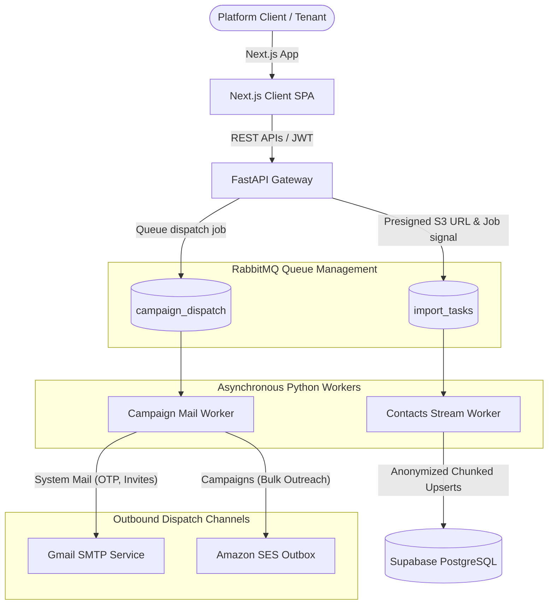

# 📧 ShrFlow Senior Developer Handover Guide

Welcome to the ShrFlow Enterprise Email Engine handover guide. This document serves as the master technical handbook for incoming senior developers, outlining the codebase architecture, database multi-tenancy model, asynchronous dispatch queues, and deployment strategies.

---

## 🏗 High-Level Architecture Overview

ShrFlow is built to scale to millions of monthly emails while guaranteeing robust multi-tenant data isolation and delivery reliability.



### 1. The Dual-Delivery Engine Principle
To safeguard system health and deliverability, ShrFlow bifurcates outbound emails into two completely independent infrastructure channels:
- **System Emails (OTPs, Password Resets, Team Invites):** Dispatched via a centralized Gmail SMTP mailbox. This ensures critical platform alerts bypass any IP warm-up delays or reputation risks associated with new tenant campaigns.
- **Campaign Emails (Bulk newsletters, promos):** Dispatched via the respective tenant's custom verified sending domain via AWS SES. This completely isolates sender reputations—reputation hits or spam complaints on one tenant's campaign never affect the delivery of system-critical OTPs or other tenants' campaigns.

### 2. Multi-Tenant Database Isolation (PostgreSQL RLS)
SaaS security is locked at the database level. Every single database table is protected by **Postgres Row Level Security (RLS)**:
- Multi-tenancy is enforced on the `tenant_id` column.
- Raw transactional write operations bypass Supabase PostgREST, using an `asyncpg` connection pool. On every transaction, `SET LOCAL app.current_tenant_id = 'tenant-uuid'` is called.
- This ensures that even if an application code path or API endpoint misses a tenant verification check, the database itself will abort any query attempting to cross-contaminate data.

---

## 📂 Core Codebase Tour

The repository is divided into two primary directory blocks inside `/platform`:

### 1. `/platform/client` (Next.js 14 Web Portal)
A modern TypeScript SPA utilizing Next.js App Router, Tailwind CSS, and shadcn/ui.
- `/src/app/(auth)`: Holds login, signup, and progressive onboarding wizard forms.
- `/src/app/(platform)/[tenantId]`: Houses all tenant-scoped pages (Dashboard, Campaigns, Contacts, Templates, Analytics, Infrastructure, and Settings).
- `/src/app/(platform)/account`: Global user Account Center, supporting profile edits, session security, multi-workspace switches, and account deletion.
- `/src/context/AuthContext.tsx`: Manages authentication sessions, progressive wizard states, and features the **Onboarding Escape Guard** (which automatically redirects users out of incomplete "ghost" workspaces).

### 2. `/platform/api` (FastAPI Gateway)
A high-performance Python ASGI backend exposing JSON API endpoints and orchestrating workers.
- `/routes`: Scoped endpoints for managing campaigns, contacts, templates, domains, and security.
- `/utils`: Database engines, connection utilities, and JWT validation middlewares.
- `/models`: SQLAlchemy schemas representing tenants, users, contacts, and logs.

### 3. `/platform/worker` (RabbitMQ Background Workers)
Dedicated aio-pika asynchronously running consumers handling high-latency operations:
- **CSV Ingestion Worker:** Streams large files from S3/MinIO in chunks of 500 rows to prevent Out-Of-Memory (OOM) failures, executes MX DNS checks, deduplicates records, and publishes progress updates over Redis Pub/Sub to active WebSockets.
- **Campaign Dispatch Worker:** Consumes campaign queues, generates MJML responsive layouts, replaces spintax merge-tags, and dispatches throttled batches to AWS SES.

---

## 🎨 Visual-to-Code Tour (Renamed Screenshots)
To help you locate key client routes immediately, all screenshots inside `docs/screen-shots/` are renamed to their exact functional equivalents. Refer to the directory below:

| Screenshot | Next.js Source Component Path | Features Shown |
| :--- | :--- | :--- |
| `landing-page.png` | `(marketing)/page.tsx` | Platform landing & marketing outbox |
| `signup.png` | `(auth)/signup/page.tsx` | User registration |
| `dashboard.png` | `[tenantId]/dashboard/page.tsx` | Workspace Control Center & setup progress checklist |
| `contacts-import-history.png` | `[tenantId]/contacts/import-history/page.tsx` | Asynchronous RabbitMQ CSV import logs & failure grids |
| `templates-list.png` | `[tenantId]/templates/page.tsx` | Email template grid library |
| `campaigns-list.png` | `[tenantId]/campaigns/page.tsx` | Outbound campaigns dispatch list & statuses |
| `analytics.png` | `[tenantId]/analytics/page.tsx` | Open rates (edge function tracking pixel), click statistics, bounces |
| `infrastructure.png` | `[tenantId]/infrastructure/page.tsx` | Worker heartbeat stats, redis load, queue depths |
| `settings-general.png` | `[tenantId]/settings/general/page.tsx` | Workspace details, logos, personalization |
| `settings-organization.png` | `[tenantId]/settings/organization/page.tsx` | Legal profile address input (CAN-SPAM act requirements) |
| `settings-team.png` | `[tenantId]/settings/team/page.tsx` | Active workspace members grid & invitations |
| `settings-franchise.png` | `[tenantId]/settings/franchise/page.tsx` | Multi-tenant sub-account & child franchise nodes setup |
| `settings-requests.png` | `[tenantId]/settings/requests/page.tsx` | Sub-franchise approval inbox for parent review |
| `settings-billing.png` | `[tenantId]/settings/billing/page.tsx` | Saas monthly limit monitors |
| `settings-audit-history.png` | `[tenantId]/settings/audit-history/page.tsx` | Immutable admin event logger |
| `settings-sending-domains.png` | `[tenantId]/settings/sending-domains/page.tsx` | AWS SES DKIM/SPF TXT records setup |
| `settings-sender-identities.png` | `[tenantId]/settings/sender-identities/page.tsx` | Verified outbox sender profiles |
| `settings-api-keys.png` | `[tenantId]/settings/api-keys/page.tsx` | API credentials builder & permissions scope |
| `account-center.png` | `account/page.tsx` | Multi-workspace gateway & switcher dashboard |
| `account-personal-details.png`| `account/profile/page.tsx` | Personal avatar & profile customization |
| `account-security.png` | `account/security/page.tsx` | Dynamic active sessions revocation lists & MFA |
| `account-deletion-modal.png` | `account/security/components/DeletionModal.tsx`| Compliance deletion modal triggering database cascades |

---

## 🛠 Local Setup & Running the Stack

ShrFlow is fully containerized. You do not need to install local runtimes (such as Python, Deno, or Node.js) on your host machine to test the environment.

### 1. Prerequisites
Ensure you have **Docker Desktop** and **Git** active on your computer.

### 2. Environment Configuration
Duplicate `.env.example` to `.env` in the root folder and configure the database connection keys:
```bash
cp .env.example .env
```
Ensure you provide:
*   `SUPABASE_URL` and `SUPABASE_SERVICE_ROLE_KEY` for database management.
*   `RABBITMQ_URL` and `REDIS_URL` for signaling.
*   AWS SES credentials and your Gmail SMTP details for testing the dual outboxes.

### 3. Apply Migrations & RLS Policies
Initialize your Supabase database schemas and active row-level-security configurations by running our database utility scripts:
```bash
# Apply SQL versioned migration files chronologically
python3 scripts/apply_all_migrations.py

# Install transaction-level RLS policies on all content tables
python3 scripts/apply_rls.py
```

### 4. Deploy Tracking Pixel Edge Function
To capture real-time email opens and click-through redirects, deploy the Supabase edge function:
```bash
supabase functions deploy track --project-ref your-project-ref
```

### 5. Seeding Template Assets
Seed default responsive MJML template designs and dummy developer sandbox entries:
```bash
# Seeding templates
python3 scripts/seed_templates.py

# Seeding sandbox user accounts and sample list structures
python3 scripts/seed_dev_data.py
```

### 6. Run the Cluster
Spin up all services (Next.js frontend, FastAPI, Redis, RabbitMQ, and the async workers) asynchronously:
```bash
docker-compose up -d --build
```
You can tail logs for all active processes:
```bash
docker-compose logs -f
```

---

## 📋 Strategic Plan & Current Roadmap Status

Refer to the phase status overview below before continuing new feature rollouts:

1. **Phase 0 & Phase 1 (Auth, Tenant Foundation, Onboarding):** **Completed & Verified.** The custom JWT, OAuth 2.0 social adapters, workspace switches, and progressive escape guards are fully functioning.
2. **Phase 1.5 & Phase 1.6 (Audit Trails & GDPR Erasure):** **Completed.** RLS policies are applied, audit trails are immutable, and contact anonymization triggers successfully.
3. **Phase 1.7 & Phase 1.8 (Invitations, Sovereignty, Account Center):** **Completed & Renamed.** Next.js pages for Account security/profile and invitation flows are locked.
4. **Phase 2 (Contacts Engine):** **Completed.** RabbitMQ parsing workers stream imports flawlessly, and rejections are safely isolated.

### Upcoming Milestones
*   **Stripe SaaS Subscription Billing:** Integrating full workspace subscription lifecycle logic.
*   **Transition System Mailer to dedicated AWS SES IP:** Move critical notification streams to high-deliverability SES scopes.

For interactive roadmap lists and live execution details, preview our docs site:
```bash
npx docsify-cli serve docs --port 4000
```
And view it directly at `http://localhost:4000` or host it globally on GitHub Pages!

