# 🎨 Visual Platform Tour & Codebase Mapping

Welcome to the visual developer walkthrough. Below, you will find high-fidelity screenshots of **every user-facing page, settings panel, and workspace route** in the ShrFlow platform, directly mapped to its corresponding Next.js client component and route folder in the codebase.

---

## 📣 Marketing & Authentication Layer

### 1. Marketing Landing Page
* **Code Route Location:** `platform/client/src/app/(marketing)/page.tsx`
* **Filename:** `landing-page.png`
* **Purpose:** High-conversion homepage demonstrating campaign creation, sending capabilities, and visual template building.

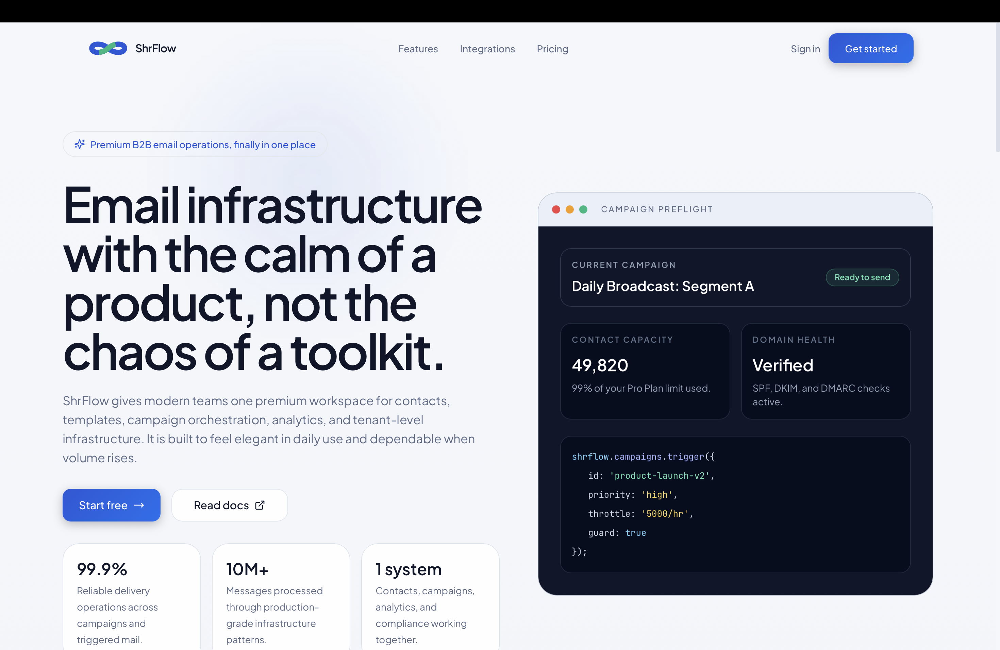

### 2. User Onboarding Signup
* **Code Route Location:** `platform/client/src/app/(auth)/signup/page.tsx`
* **Filename:** `signup.png`
* **Purpose:** Multi-tenant registration gateway creating a standard account and initiating the progressive onboarding wizard.

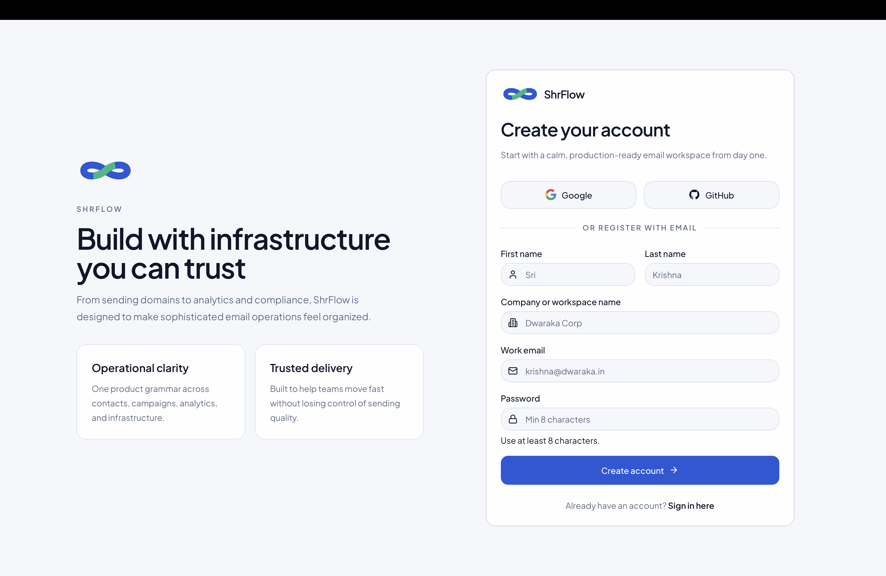

---

## 💼 Core Workspace Operations

### 3. Workspace Control Center Dashboard
* **Code Route Location:** `platform/client/src/app/(platform)/[tenantId]/dashboard/page.tsx`
* **Filename:** `dashboard.png`
* **Purpose:** High-level dashboard presenting key operational statistics (sent emails, deliverability health percentage, bounce metrics) and the launch setup checklist.

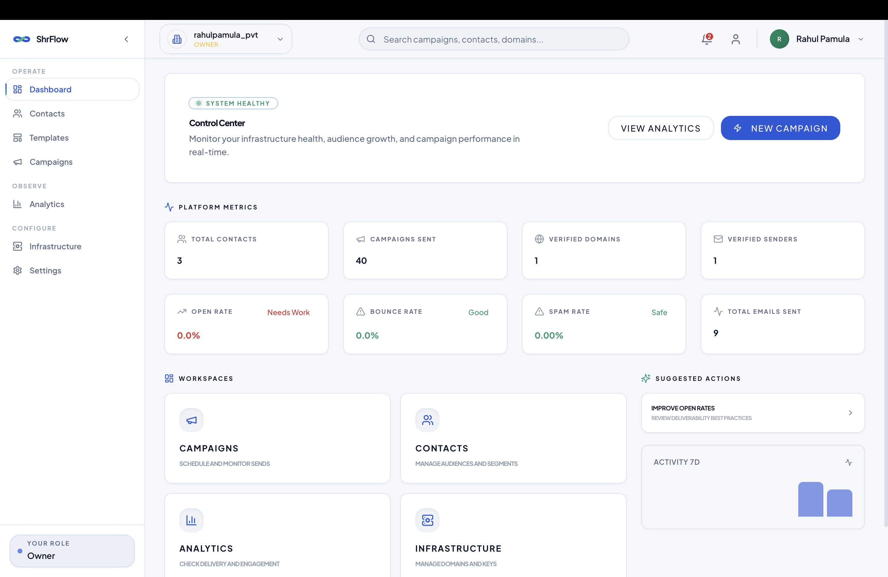

### 4. Audience Import History
* **Code Route Location:** `platform/client/src/app/(platform)/[tenantId]/contacts/import-history/page.tsx`
* **Filename:** `contacts-import-history.png`
* **Purpose:** Detailed logs representing imported contact lists, status of the background RabbitMQ CSV stream-parsing job, raw rows processed, and error/rejected counts.

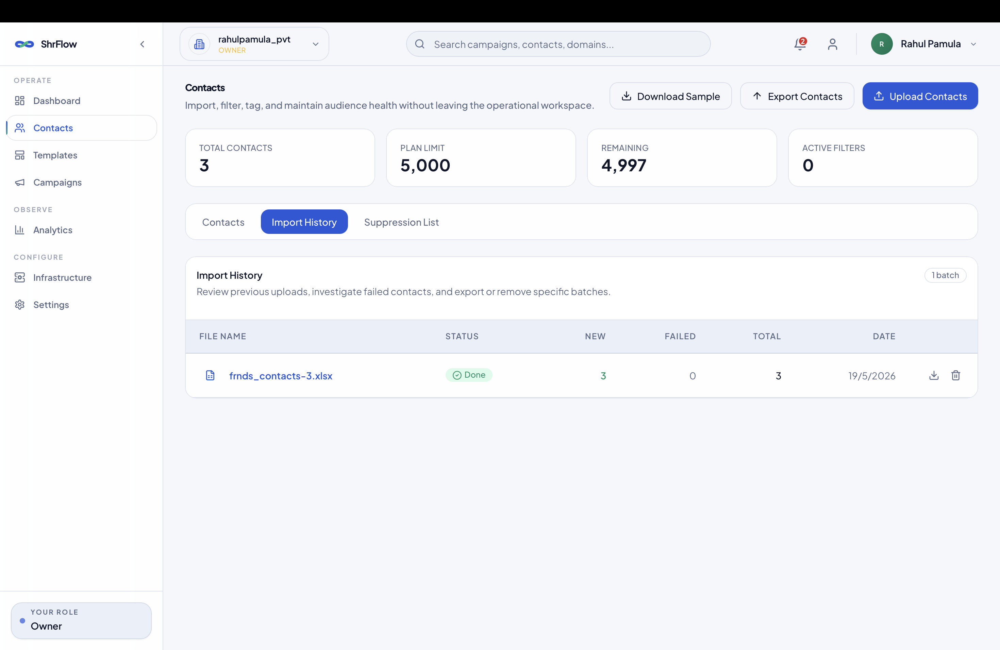

### 5. Email Layouts Library
* **Code Route Location:** `platform/client/src/app/(platform)/[tenantId]/templates/page.tsx`
* **Filename:** `templates-list.png`
* **Purpose:** View-grid representing all user-saved MJML email templates, including status checks and quick-edit options.

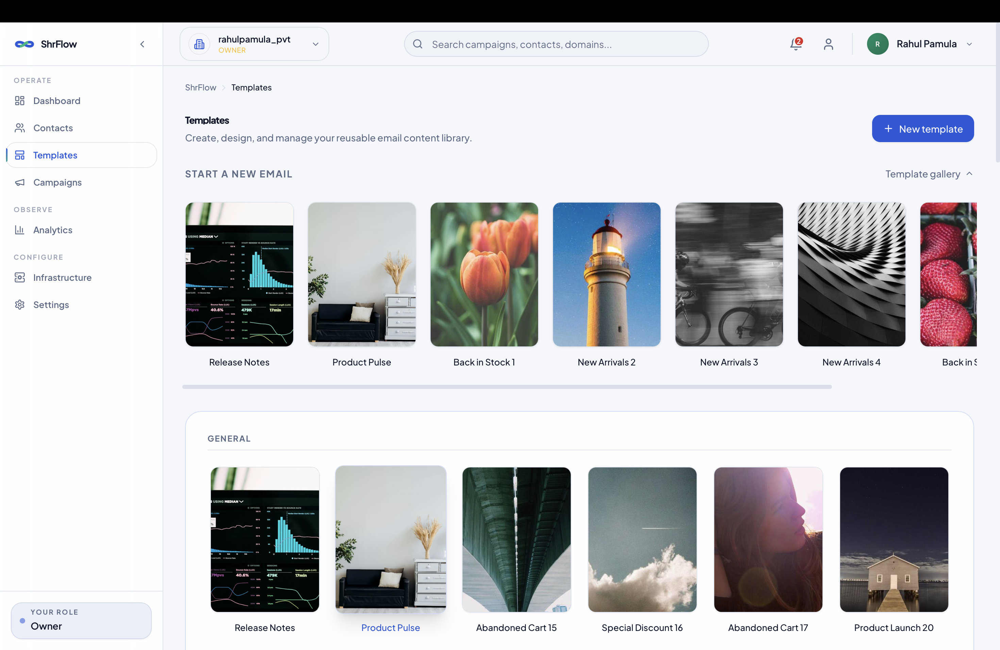

### 6. Campaign Orchestration List
* **Code Route Location:** `platform/client/src/app/(platform)/[tenantId]/campaigns/page.tsx`
* **Filename:** `campaigns-list.png`
* **Purpose:** Displays all bulk marketing campaigns with details on progress (Sent, Draft, Sending, Paused) and dispatch rate metrics.

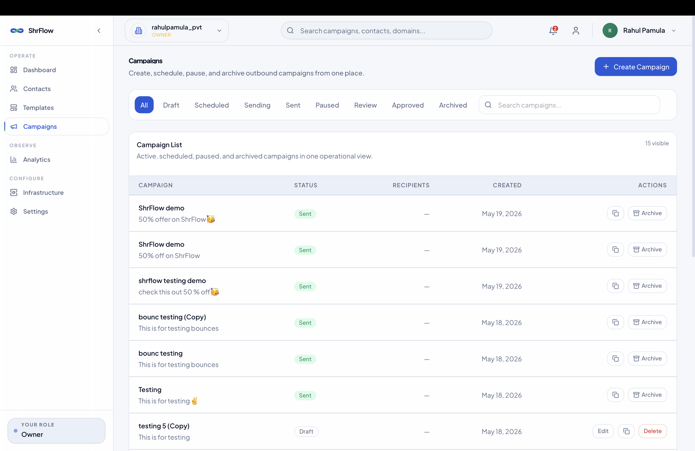

### 7. Core Analytics & Reports
* **Code Route Location:** `platform/client/src/app/(platform)/[tenantId]/analytics/page.tsx`
* **Filename:** `analytics.png`
* **Purpose:** Detailed campaign performance charts tracking deliveries, opens (pixel triggers), clicks, and spam complaints.

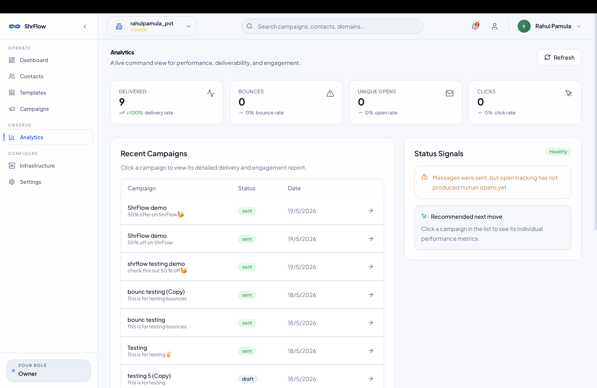

### 8. System Infrastructure Status
* **Code Route Location:** `platform/client/src/app/(platform)/[tenantId]/infrastructure/page.tsx`
* **Filename:** `infrastructure.png`
* **Purpose:** Unified devops portal showing system latency, worker heartbeat tracking, RabbitMQ queue depths, and Redis key status.

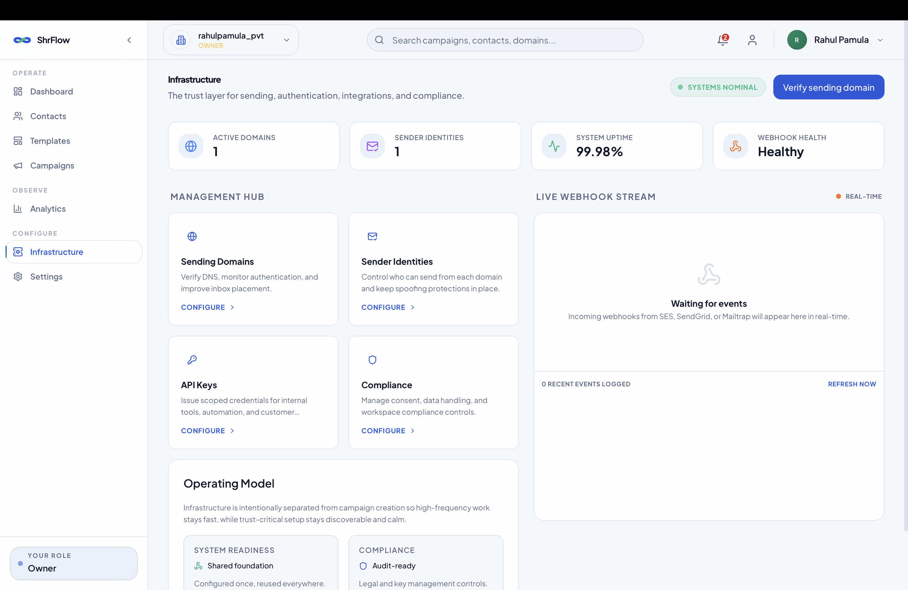

---

## ⚙️ Workspace Administration & Settings

### 9. General Settings & Personalization
* **Code Route Location:** `platform/client/src/app/(platform)/[tenantId]/settings/general/page.tsx`
* **Filename:** `settings-general.png`
* **Purpose:** Workspace name configuration, logo upload, and metadata customization settings.

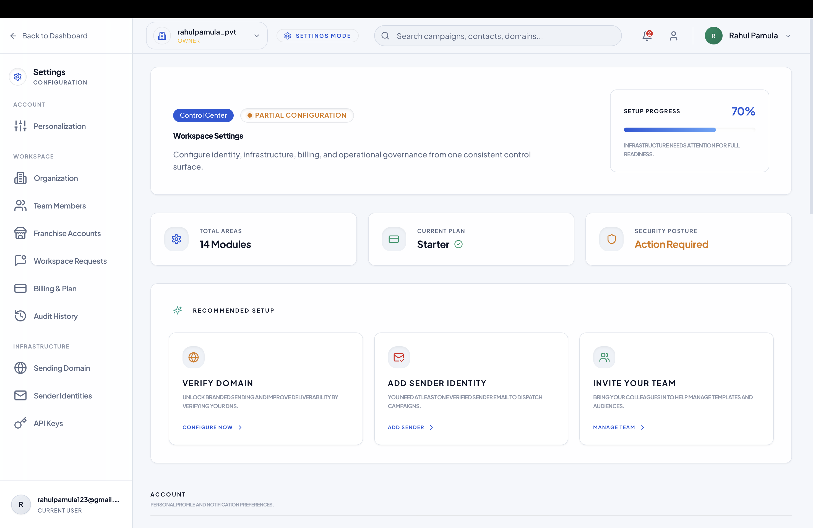

### 10. Organization Settings
* **Code Route Location:** `platform/client/src/app/(platform)/[tenantId]/settings/organization/page.tsx`
* **Filename:** `settings-organization.png`
* **Purpose:** Legal profile details for physical mailing address settings (critical for CAN-SPAM compliance headers).

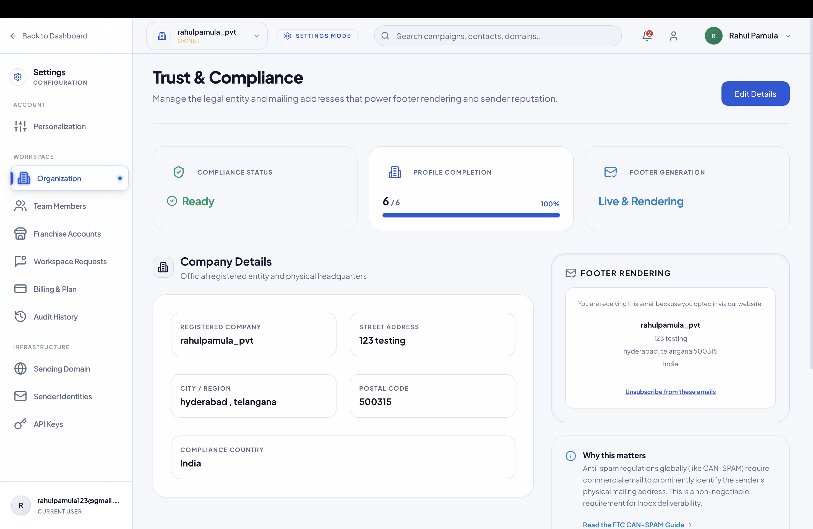

### 11. Team Members Management
* **Code Route Location:** `platform/client/src/app/(platform)/[tenantId]/settings/team/page.tsx`
* **Filename:** `settings-team.png`
* **Purpose:** Standard active members panel allowing workspace Owners/Admins to invite new users, revoke access, and change roles.

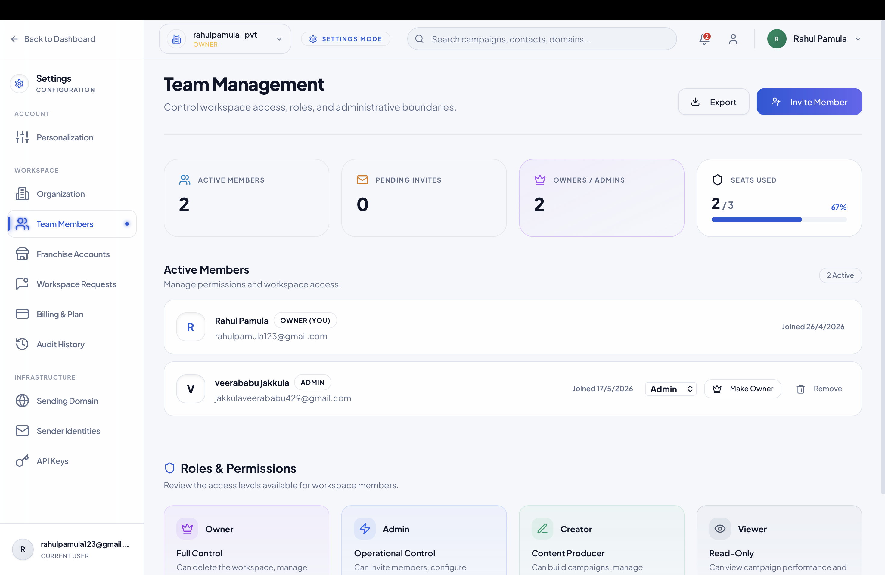

### 12. Franchise Setup & Multi-Tenancy
* **Code Route Location:** `platform/client/src/app/(platform)/[tenantId]/settings/franchise/page.tsx`
* **Filename:** `settings-franchise.png`
* **Purpose:** Hierarchical account builder used to set up child or franchise workspaces linked under a parent scope.

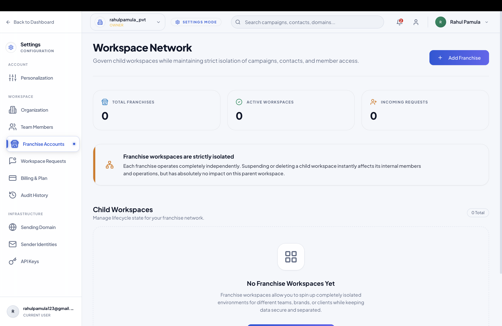

### 13. Franchise Requests Inbox
* **Code Route Location:** `platform/client/src/app/(platform)/[tenantId]/settings/requests/page.tsx`
* **Filename:** `settings-requests.png`
* **Purpose:** Access request control deck enabling parents to approve/deny operational privilege requests made by sub-franchise accounts.

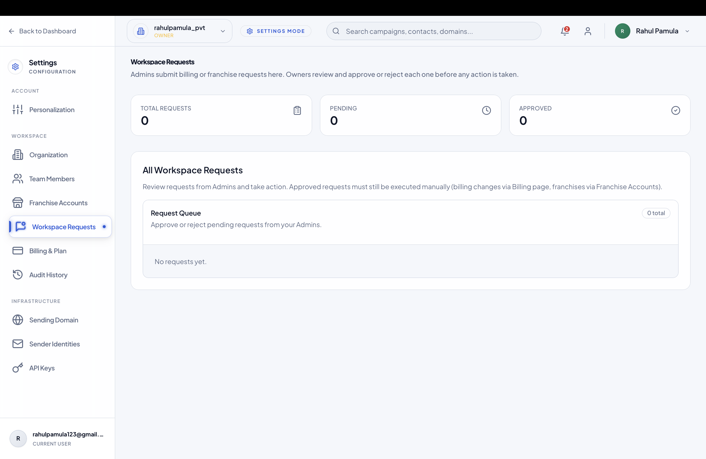

### 14. Workspace SaaS Billing
* **Code Route Location:** `platform/client/src/app/(platform)/[tenantId]/settings/billing/page.tsx`
* **Filename:** `settings-billing.png`
* **Purpose:** Plan limit monitors showing real-time monthly email limits and credit card subscription details.

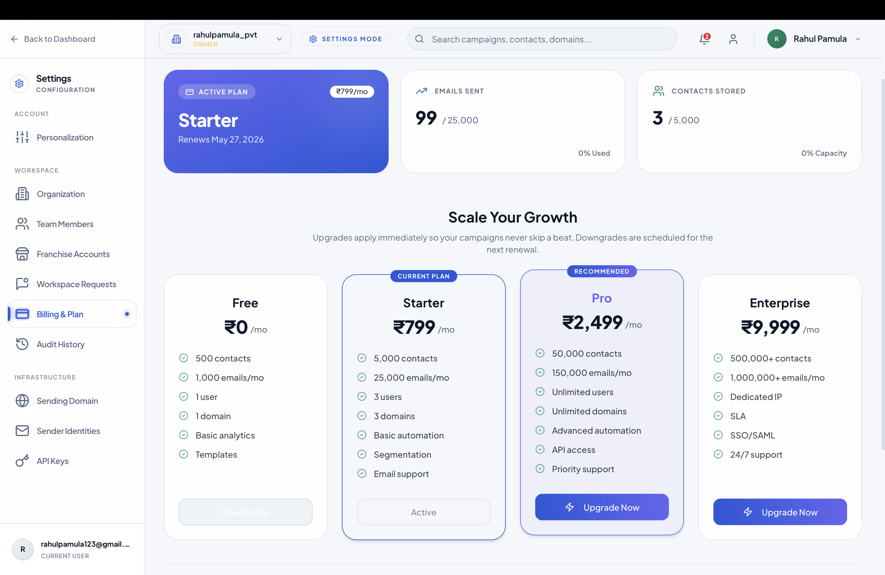

### 15. Security Audit Log
* **Code Route Location:** `platform/client/src/app/(platform)/[tenantId]/settings/audit-history/page.tsx`
* **Filename:** `settings-audit-history.png`
* **Purpose:** Immutable compliance list representing all critical admin actions performed in the workspace.

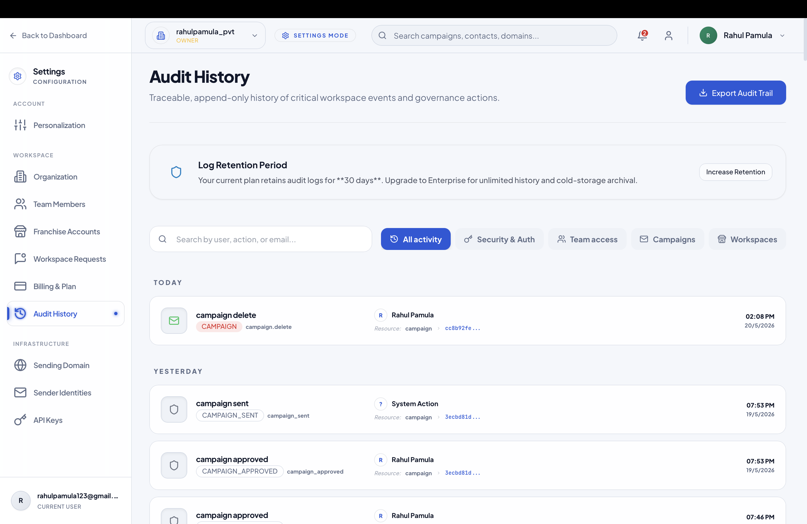

### 16. DNS Sending Domains
* **Code Route Location:** `platform/client/src/app/(platform)/[tenantId]/settings/sending-domains/page.tsx`
* **Filename:** `settings-sending-domains.png`
* **Purpose:** Configures custom AWS SES DKIM/SPF TXT records to authenticate outbound bulk email servers.

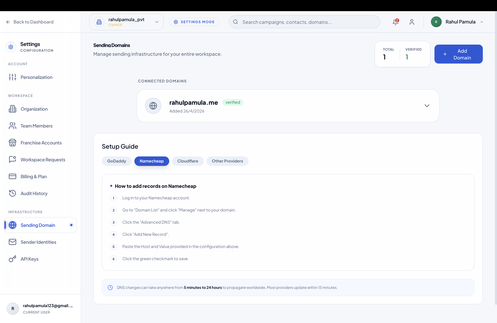

### 17. Verified Sender Identities
* **Code Route Location:** `platform/client/src/app/(platform)/[tenantId]/settings/sender-identities/page.tsx`
* **Filename:** `settings-sender-identities.png`
* **Purpose:** Set up "From" address sender profiles (e.g. `newsletter@domain.com`) that link to authenticated domains.

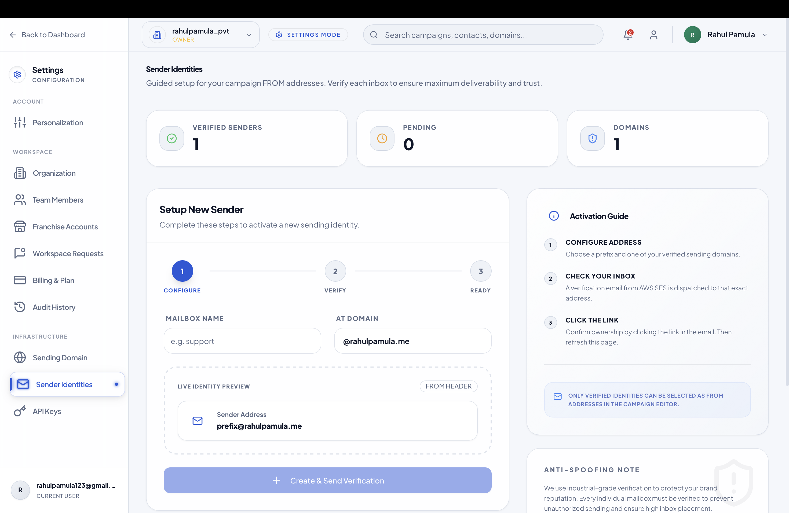

### 18. API Keys & Credentials
* **Code Route Location:** `platform/client/src/app/(platform)/[tenantId]/settings/api-keys/page.tsx`
* **Filename:** `settings-api-keys.png`
* **Purpose:** Create, copy, and scope bearer tokens to interact with the API endpoints programmatically.

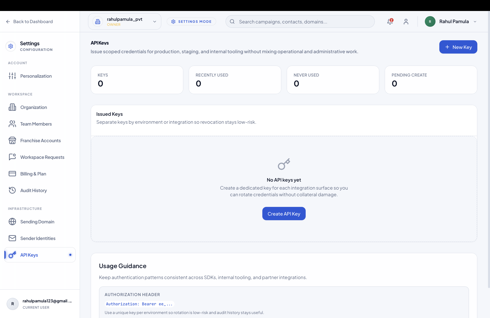

---

## 👤 Personal Account Center

### 19. Core Workspace Selection Portal
* **Code Route Location:** `platform/client/src/app/(platform)/account/page.tsx`
* **Filename:** `account-center.png`
* **Purpose:** Multi-workspace gateway page presenting all tenants a user belongs to, pending invitations, and the option to launch a new workspace.

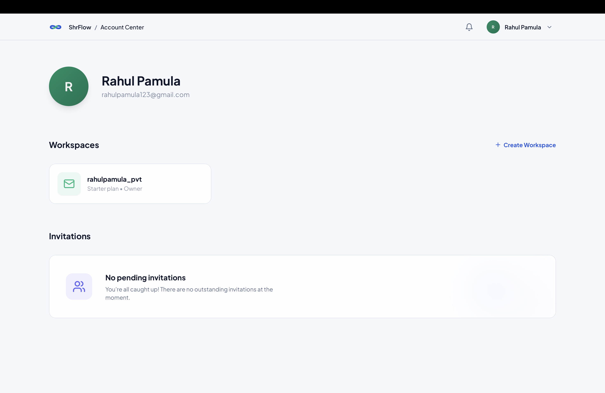

### 20. Personal Profile Editor
* **Code Route Location:** `platform/client/src/app/(platform)/account/profile/page.tsx`
* **Filename:** `account-personal-details.png`
* **Purpose:** Update first/last names, avatar pictures, and default dashboard preferences.

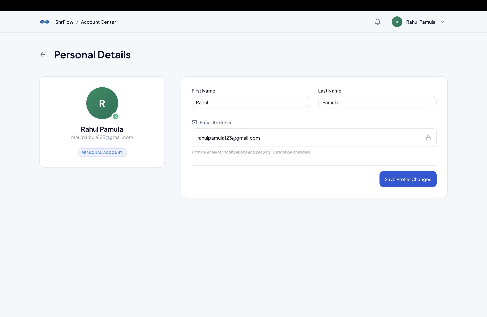

### 21. User Security Center
* **Code Route Location:** `platform/client/src/app/(platform)/account/security/page.tsx`
* **Filename:** `account-security.png`
* **Purpose:** MFA configurations, password upgrades, and dynamic list of active sessions with "Revoke All" capability.

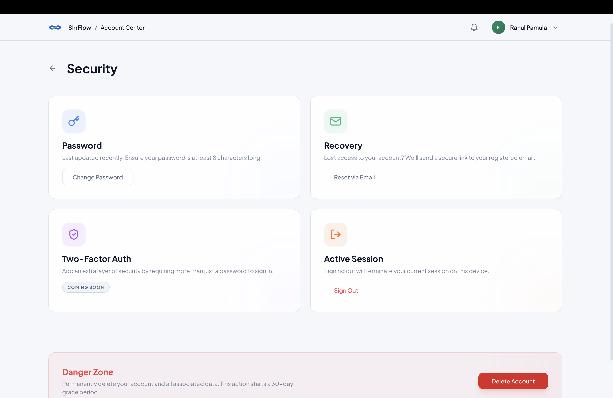

### 22. Account Deletion Gateway (GDPR Compliance)
* **Code Route Location:** `platform/client/src/app/(platform)/account/security/components/DeletionModal.tsx`
* **Filename:** `account-deletion-modal.png`
* **Purpose:** Trigger modal enabling irreversible profile scrubbing with RLS-cascaded access revocation.

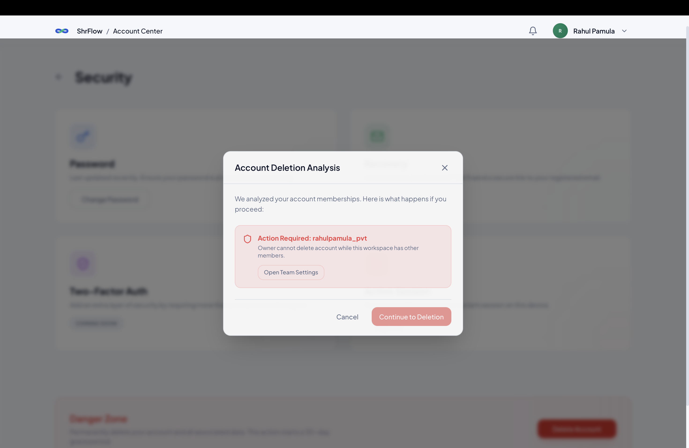
